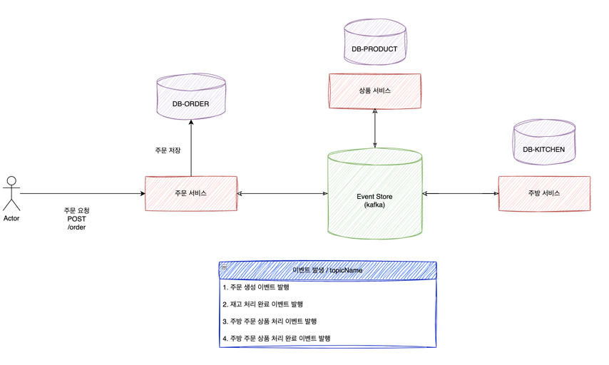

# 사가 패턴 실습 (코드 수정 중...)

## 목표 구조도



## 개발 시나리오

- 유저가 주문을 요청해요.

```json
{
  "userId": 1234,
  "orderProducts": [
    {
      "productId": 123,
      "amount": 4
    },
    {
      "productId": 124,
      "amount": 5
    }
  ]
}
```

- 주문 서비스는 유저의 주문 요청을 바탕으로 주문 도메인을 생성하고 저장해요

``` kotlin
    val savedOrder = orderUseCase.saveOrder(
        order = Order.fromOrderRequest(orderRequest),
    )

    val saveOrderProduct = orderUseCase.saveOrderProduct(
        orderProducts = OrderProduct(
            orderId = savedOrder.id,
            productItems = orderRequest.productItems,
        )
    )
```

- 생성된 주문 정보를 바탕으로 주문 생성 이벤트를 생성해요.

``` kotlin
    val orderEvent = OrderProductEvent(
        txId = savedOrder.txId,
        orderId = savedOrder.id,
        productItems = saveOrderProduct.productItems,
    )
```

- 이벤트 발행기를 정의하고 주문 생성 - 상품 재고 이벤트를 발행해요.

``` kotlin
    @Component
    class OrderProductEventHandler(
        private val eventPublisher: EventPublisher<EventMessage<OrderProductEvent>>,
    ) : EventHandler<OrderProductEvent> {
        override suspend fun handle(event: OrderProductEvent) {
            eventPublisher.publish(
                eventName = EventPublishName.ORDER_TO_PRODUCT_STOCK,
                message = EventMessage(
                    target = EventTarget.ORDER_CREATION,
                    txId = event.txId,
                    status = EventStatus.APPROVED,
                    message = event,
                )
            )
        }
    }
```

- 주문 생성 관련한 이벤트를 컨슈머를 정의하고 이벤트를 소모해요.

``` kotlin
    @KafkaListener(topics = ["product-to-order-product-stock"], groupId = "saga")
    override fun consumeProductStock(message: EventMessage<ProductOrderBill>) {

        coroutineScope.launch {
            when(message.status) {
                EventStatus.APPROVED -> eventDispatcher.dispatch(
                    event = OrderKitchenEvent.fromOrderProductBill(message.message)
                )
                EventStatus.REJECTED -> eventDispatcher.dispatch(
                    TODO("보상 트랜잭션")
                )
            }
        }
    }

```

- 이 단계에서 각 요청 상태에 따라 다음 스탭을 위한 이벤트 혹은, 보상 트랜잭션 등의 이벤트를 발행해요


## 문제점
- 이벤트 컨슈머 다시 이벤트를 생성하고 디스패처로 넘기는 구조인데, 컨슈머의 역할이 많고, 복잡해요.
  - 이벤트 컨슈머가 다시 디스패처로 다음 스탭을 위한 비즈니스 로직을 호출하는 구조인데, 더 좋은 설계가 있는지 고민 중이에요.


## 실행 (확정 아닙니다!)

```
docker compose up --build -d

docker exec -it [docker id] kafka-topics --create --bootstrap-server localhost:9092 --replication-factor 1 --partitions 1 --topic order-to-test
docker exec -it [docker id] kafka-topics --create --bootstrap-server localhost:9092 --replication-factor 1 --partitions 1 --topic order-to-product-product-stock
docker exec -it [docker id] kafka-topics --create --bootstrap-server localhost:9092 --replication-factor 1 --partitions 1 --topic order-to-customer-validation
docker exec -it [docker id] kafka-topics --create --bootstrap-server localhost:9092 --replication-factor 1 --partitions 1 --topic order-to-kitchen-status

docker exec -it [docker id] kafka-topics --create --bootstrap-server localhost:9092 --replication-factor 1 --partitions 1 --topic customer-to-order-customer-validation
docker exec -it [docker id] kafka-topics --create --bootstrap-server localhost:9092 --replication-factor 1 --partitions 1 --topic product-to-order-product-stock
docker exec -it [docker id] kafka-topics --create --bootstrap-server localhost:9092 --replication-factor 1 --partitions 1 --topic kitchen-to-order-kitchen-status

docker exec -it [docker id] /usr/bin/kafka-topics --list --bootstrap-server localhost:9092
```

