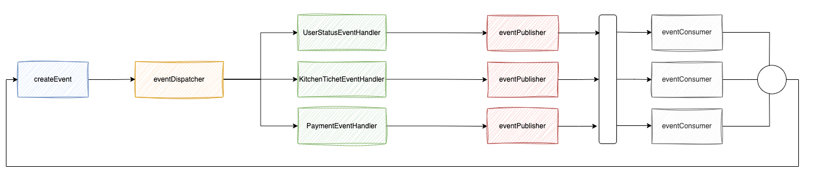

# 사가 패턴 실습

## 1. 목표 와이어 프레임

- 유저가 주문을 요청에 대한 각 서비스를 사가 패턴으로 구현해요.

## 2. 이벤트 발행 구조



- 이벤트를 발행하고 각 이벤트의 타입에 따라 Dispathcer가 이벤트 핸들러를 호출해요.
- EventHandler 정의된 EventPublisher로 이벤트를 발행해요.
- EventConsumer는 메세지를 수신하고, 각 상황에 맞는 이벤트를 발급해요.

## 3.

## 4. 문제점

- 이벤트 컨슈머 다시 이벤트를 생성하고 디스패처로 넘기는 구조인데, 컨슈머의 역할이 많고, 복잡해요.
    - 이벤트 컨슈머가 다시 디스패처로 다음 스탭을 위한 비즈니스 로직을 호출하는 구조인데, 더 좋은 설계가 있는지 고민 중이에요.

## 5. 실행 (확정 아닙니다!)

```
docker compose up --build -d

docker exec -it [docker id] kafka-topics --create --bootstrap-server localhost:9092 --replication-factor 1 --partitions 1 --topic order-to-test
docker exec -it [docker id] kafka-topics --create --bootstrap-server localhost:9092 --replication-factor 1 --partitions 1 --topic order-to-product-product-stock
docker exec -it [docker id] kafka-topics --create --bootstrap-server localhost:9092 --replication-factor 1 --partitions 1 --topic order-to-customer-validation
docker exec -it [docker id] kafka-topics --create --bootstrap-server localhost:9092 --replication-factor 1 --partitions 1 --topic order-to-kitchen-status

docker exec -it [docker id] kafka-topics --create --bootstrap-server localhost:9092 --replication-factor 1 --partitions 1 --topic customer-to-order-customer-validation
docker exec -it [docker id] kafka-topics --create --bootstrap-server localhost:9092 --replication-factor 1 --partitions 1 --topic product-to-order-product-stock
docker exec -it [docker id] kafka-topics --create --bootstrap-server localhost:9092 --replication-factor 1 --partitions 1 --topic kitchen-to-order-kitchen-status

docker exec -it [docker id] /usr/bin/kafka-topics --list --bootstrap-server localhost:9092
```

