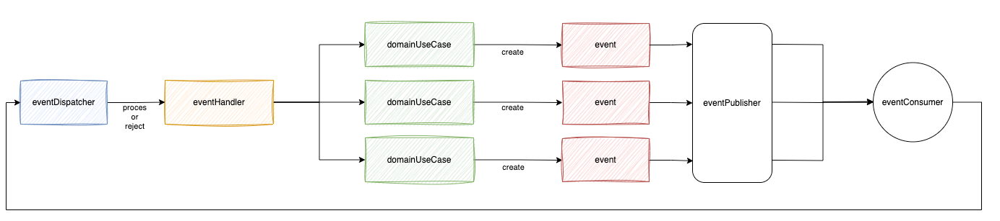

# 사가 패턴 - 주문 로직 구현

## 1. 목표 와이어 프레임


- 유저가 주문을 요청에 대한 각 서비스를 사가 패턴으로 구현해요.
- 라이브러리 없이 직접 이벤트 발행 / 수신 구조로 사가 패턴을 구현해요.
- MSA 및 헥사고날 아키텍처를 적용해요.

## 2. 이벤트 발행 구조



## 3. 주문 요청 진행 과정

``` kotlin
    @KafkaListener(topics = ["user-to-order-status"], groupId = "saga")
    override fun consumeUserStatus(@Payload message: EventMessage<UserStatusConsumeEvent>) {
        val clazz = UserStatusConsumeEvent::class
        coroutineScope.launch {
            eventConsumeDispatcher.dispatch(message, clazz)
        }
    }
```
- EventConsumer는 메세지를 수신하고, EventConsumeDispatcher를 호출해요.

``` kotlin

    suspend fun dispatch(message: EventMessage<OrderConsumeEvent>, clazz: KClass<out OrderConsumeEvent>) {
        when (message) {
            is TargetEventMessage<OrderConsumeEvent> -> {
                when(val event = message.message) {
                    is UserStatusConsumeEvent -> orderKitchenTicketCreationHandler.process(event)
                    is OrderKitchenTicketCreationConsumeEvent -> orderPaymentCreationEventHandler.process(event)
                    is OrderPaymentStatusConsumeEvent -> orderKitchenTicketStatusHandler.process(event)
                    is OrderKitchenStatusConsumeEvent -> orderStatusEventHandler.process(event)
                }
            }

            is ErrorEventMessage<OrderConsumeEvent> -> {
                when(clazz) {
                    UserStatusConsumeEvent::class -> orderUseCase.rejectOrder(txId = message.txId, orderRejectReason = message.errorMessage)
                    OrderKitchenTicketCreationConsumeEvent::class -> orderUseCase.rejectOrder(txId = message.txId, orderRejectReason = message.errorMessage)
                    OrderPaymentStatusConsumeEvent::class -> orderKitchenTicketCreationHandler.reject(message.txId, rejectReason = message.errorMessage)
                    OrderKitchenStatusConsumeEvent::class -> orderPaymentCreationEventHandler.reject(message.txId, rejectReason = message.errorMessage)
                }
            }
        }
    }
```
- EventConsumeDispatcher는 수신한 이벤트 결과를 바탕으로 다음 이벤트 핸들러를 호출해요.  


``` kotlin
    override suspend fun process(event: UserStatusConsumeEvent) {

        when (event.userStatus) {
            UserStatusType.NOMAL -> {
                val orderKitchenTicketEventMessage= createOrderKitchenTicketEvent(txId = event.txId)
                eventPublisher.publish(
                    eventName = EventPublishName.ORDER_TO_KITCHEN_CREATION,
                    message = orderKitchenTicketEventMessage,
                )
            }

            UserStatusType.ABNOMAL -> {
                orderUseCase.rejectOrder(
                    txId = event.txId,
                    orderRejectReason = OrderRejectReason.USER_ABNOMAL.name
                )
            }
        }
    }
    
    private suspend fun createOrderKitchenTicketEvent(txId: String): EventMessage<Event> {
        return EventMessageCreator.createMessage(
            eventTarget = EventTarget.ORDER_CREATION,
            txId = txId,
            eventAction = {
                orderKitchenUseCase.createOrderKitchenEvent(txId = txId)
            }
        )
    }
```
- 이벤트 핸들러는 이벤트 메세지를 생성하는 EventMessageCreator에 이벤트를 생성하는 유즈케이스를 람다 인자로 넣어 이벤트를 만들어요.

``` kotlin

    @JsonTypeInfo(use = JsonTypeInfo.Id.NAME, include = JsonTypeInfo.As.PROPERTY, property = "type")
    @JsonSubTypes(
        JsonSubTypes.Type(value = TargetEventMessage::class, name = "TargetEventMessage"),
        JsonSubTypes.Type(value = ErrorEventMessage::class, name = "ErrorEventMessage"),
    )
    sealed class EventMessage<out T>(
        open val target: EventTarget,
        open val txId: String,
    )
    
    data class TargetEventMessage<T>(
        override val target: EventTarget,
        override val txId: String,
        val message: T,
    ) : EventMessage<T>(target = target, txId = txId)
    
    data class ErrorEventMessage<T>(
        override val target: EventTarget,
        override val txId: String,
        val errorMessage: String,
    ) : EventMessage<T>(target = target, txId = txId)

```
- 이벤트는 TargetEventMessage(비즈니스적인 목표를 수행하는 메세지), ErrorEventMessage(비즈니스 로직 구현 중 발생한 에러)로 구성되요.

``` kotlin
    fun createMessage(eventTarget: EventTarget, txId: String, eventAction: () -> Event): EventMessage<Event> {
        return try {
            val event = eventAction.invoke()

            TargetEventMessage(
                target = eventTarget,
                txId = event.txId,
                message = event,
            )
        } catch (e: Exception) {
            ErrorEventMessage(
                target = eventTarget,
                txId = txId,
                errorMessage = e.message.toString()
            )
        }
    }
```
- 이벤트를 만드는 람다 인자를 받아 invoke()로 호출함으로써 위에 정의한 이벤트 메세지 형태로 구성해요.

``` kotlin
    override fun publish(eventName: EventPublishName, message: EventMessage<Event>) {
        kafkaTemplate.send(
            eventName.topicName,
            message,
        )
    }
```
- EventPublisher로 이벤트를 발행해요.

``` kotlin
    override suspend fun reject(txId: String, rejectReason: String) {
        val orderKitchenStatusEvent = updateRejectKitchenStatusEvent(txId)

        eventPublisher.publish(
            eventName = EventPublishName.ORDER_TO_KITCHEN_STATUS,
            message = orderKitchenStatusEvent,
        )
```
- 만약 정상 응답을 받았을 떄, 받은 이벤트가 REJECT 상태를 의미하거나, 에러 응답을 받은 경우 이전 단계에 대한 보상 트랜잭션을 진행해요

## 5. 발생한 문제 극복 과정 
 
``` kotlin
    @JsonTypeInfo(use = JsonTypeInfo.Id.NAME, include = JsonTypeInfo.As.PROPERTY, property = "type")
    @JsonSubTypes(
        JsonSubTypes.Type(value = TargetEventMessage::class, name = "TargetEventMessage"),
        JsonSubTypes.Type(value = ErrorEventMessage::class, name = "ErrorEventMessage"),
    )
    sealed class EventMessage<out T>(
        open val target: EventTarget,
        open val txId: String,
    )
```
- EventMessage에 사용되는 제네릭 타입인 Event를 유연하게 사용하기 위해 공변성화 하였어요.
  - 이를 통해 EventMessage<Event> 타입을 인자로 받는 함수에 하위 클래스를 넣어서 메세지 발행을 처리할 수 있었어요.
- 카프카 이벤트 발행 및 수신 과정에서 제네릭 타입을 쓰는 경우, 타입 소거로 인해 직렬화 역직렬화 에러가 발생해요.
  - 객체의 다형성을 유지할 수 있는 @JsonTypeInfo, @JsonSubTypes 어노테이션을 사용하였어요.
    - @JsonTypeInfo
      - 하위 클래스들의 객체를 Json으로 변환할 떄, 어떤 클래스의 인스턴스인지 알려주는 정보를 json에 추가해요.
    - @JsonSubTypes
      - 상위 또는 구체적인 하위 타입을 정의해요.

``` kotlin
    is TargetEventMessage<OrderConsumeEvent> -> {
        when(val event = message.message) {
            is UserStatusConsumeEvent -> orderKitchenTicketCreationHandler.process(event)
            is OrderKitchenTicketCreationConsumeEvent -> orderPaymentCreationEventHandler.process(event)
            is OrderPaymentStatusConsumeEvent -> orderKitchenTicketStatusHandler.process(event)
            is OrderKitchenStatusConsumeEvent -> orderStatusEventHandler.process(event)
        }
    }
```
- 이벤트 컨슈머가 특정 이벤트를 수신한 후, 디스패처를 호출하여 디스패처가 각 이벤트 핸들러를 적절하게 호출하는 방식을 적용했어요.
  - 이벤트 컨슈머는 이벤트를 수신하고 디스패처 호출, 디스패처는 적절한 핸들러에게 위임, 핸들러에서 처리하도록 하여 역할과 책임을 분리하였어요

## 6. 한계

- A 이벤트의 결과를 바탕으로 B 이벤트를 호출하는 결과에서 이벤트간 강한 결합이 발생해요.
  - 결합도를 줄이는 방법을 고민 중이에요!


## 7. 도커 및 카프카 실행 
```
    docker compose up --build -d
    
    docker exec -it [docker id] kafka-topics --create --bootstrap-server localhost:9092 --replication-factor 1 --partitions 1 --topic order-to-user-status
    docker exec -it [docker id] kafka-topics --create --bootstrap-server localhost:9092 --replication-factor 1 --partitions 1 --topic order-to-kitchen-ticket-creation
    docker exec -it [docker id] kafka-topics --create --bootstrap-server localhost:9092 --replication-factor 1 --partitions 1 --topic order-to-kitchen-ticket-status
    docker exec -it [docker id] kafka-topics --create --bootstrap-server localhost:9092 --replication-factor 1 --partitions 1 --topic order-to-payment-pay
    
    docker exec -it [docker id] kafka-topics --create --bootstrap-server localhost:9092 --replication-factor 1 --partitions 1 --topic user-to-order-status
    docker exec -it [docker id] kafka-topics --create --bootstrap-server localhost:9092 --replication-factor 1 --partitions 1 --topic kitchen-to-order-ticket-creation
    docker exec -it [docker id] kafka-topics --create --bootstrap-server localhost:9092 --replication-factor 1 --partitions 1 --topic payment-to-order-pay
    docker exec -it [docker id] kafka-topics --create --bootstrap-server localhost:9092 --replication-factor 1 --partitions 1 --topic kitchen-to-order-ticket-status
```

