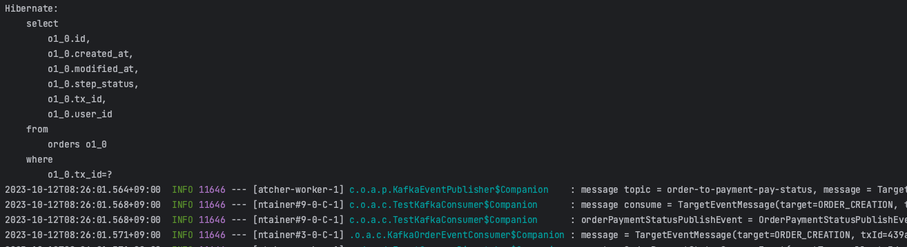
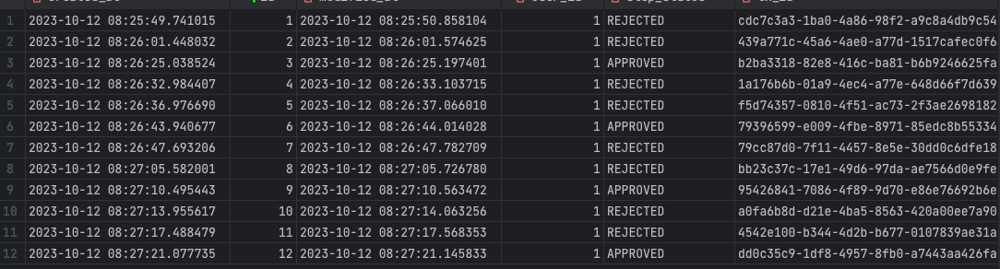

# 사가 패턴 - 주문 로직 구현

## 1. 목표 와이어 프레임


- 유저가 주문을 요청에 대한 각 서비스를 사가 패턴으로 구현해요.
- 라이브러리 없이 직접 이벤트 발행 / 수신 구조로 사가 패턴을 구현해요.
- MSA 및 헥사고날 아키텍처를 적용해요.

## 2. 이벤트 발행 구조


  

## 3. 주문 요청 진행 과정

``` kotlin
    @KafkaListener(topics = ["user-to-order-status"], groupId = "saga")
    override fun consumeUserStatus(@Payload message: EventMessage<UserStatusConsumeEvent>) {
        val clazz = UserStatusConsumeEvent::class
        coroutineScope.launch {
            eventConsumeDispatcher.dispatch(message, clazz)
        }
    }
```
- EventConsumer는 메세지를 수신하고, EventConsumeDispatcher를 호출해요. [KafkaOrderEventConsumer](https://github.com/daaaang/shein/blob/main/saga-pattern/order/adapter/src/main/kotlin/com/order/adapter/consumer/KafkaOrderEventConsumer.kt)

``` kotlin
    suspend fun dispatch(message: EventMessage<OrderConsumeEvent>, clazz: KClass<out OrderConsumeEvent>) {
        when (message) {
            is TargetEventMessage<OrderConsumeEvent> -> {
                val event = objectMapper.convertValue(message.message, OrderConsumeEvent::class.java)
                when(event) {
                    is UserStatusConsumeEvent -> orderKitchenTicketCreationHandler.process(event)
                    is OrderKitchenTicketCreationConsumeEvent -> orderPaymentCreationEventHandler.process(event)
                    is OrderPaymentStatusConsumeEvent -> orderKitchenTicketStatusHandler.process(event)
                    is OrderKitchenTicketStatusConsumeEvent -> orderStatusEventHandler.process(event)
                }
            }

            is ErrorEventMessage<OrderConsumeEvent> -> {
                when(clazz) {
                    UserStatusConsumeEvent::class -> orderUseCase.rejectOrder(txId = message.txId, orderRejectReason = message.errorMessage)
                    OrderKitchenTicketCreationConsumeEvent::class -> orderUseCase.rejectOrder(txId = message.txId, orderRejectReason = message.errorMessage)
                    OrderPaymentStatusConsumeEvent::class -> orderKitchenTicketCreationHandler.reject(message.txId, rejectReason = message.errorMessage)
                    OrderKitchenTicketStatusConsumeEvent::class -> orderPaymentCreationEventHandler.reject(message.txId, rejectReason = message.errorMessage)
                }
            }
        }
    }
```
- EventConsumeDispatcher는 수신한 이벤트 결과를 바탕으로 다음 이벤트 핸들러를 호출해요. [EventConsumeDispatcher](https://github.com/daaaang/shein/blob/main/saga-pattern/order/domain/src/main/kotlin/com/order/domain/events/dispatcher/EventConsumeDispatcher.kt)

``` kotlin
    override suspend fun process(event: UserStatusConsumeEvent) {

        when (event.userStatus) {
            UserStatusType.NOMAL -> {
                val orderKitchenTicketEventMessage= createOrderKitchenTicketEvent(txId = event.txId)
                eventPublisher.publish(
                    eventName = EventPublishName.ORDER_TO_KITCHEN_CREATION,
                    message = orderKitchenTicketEventMessage,
                )
            }

            UserStatusType.ABNOMAL -> {
                reject(txId = event.txId)
            }
        }
    }

    override suspend fun reject(txId: String, rejectReason: String) {
        orderUseCase.rejectOrder(
            txId = txId,
            orderRejectReason = OrderRejectReason.USER_ABNOMAL.name
        )
    }
```
- 이벤트 핸들러는 이벤트 메세지를 생성하는 EventMessageCreator에 이벤트를 생성하는 유즈케이스를 람다 인자로 넣어 이벤트를 만들어요. [OrderKitchenTicketCreationHandler](https://github.com/daaaang/shein/blob/main/saga-pattern/order/domain/src/main/kotlin/com/order/domain/events/handler/OrderKitchenTicketCreationHandler.kt)
``` kotlin
    data class TargetEventMessage<T>(
        override val target: EventTarget,
        override val txId: String,
        val message: T,
    ) : EventMessage<T>(target = target, txId = txId)
    
    data class ErrorEventMessage<T>(
        override val target: EventTarget,
        override val txId: String,
        val errorMessage: String,
    ) : EventMessage<T>(target = target, txId = txId)

```
- 이벤트는 TargetEventMessage(비즈니스적인 목표를 수행하는 메세지), ErrorEventMessage(비즈니스 로직 구현 중 발생한 에러)로 구성되요. [EventMessage](https://github.com/daaaang/shein/blob/main/saga-pattern/order/domain/src/main/kotlin/com/order/domain/events/EventMessage.kt)

``` kotlin
    fun createMessage(eventTarget: EventTarget, txId: String, eventAction: () -> Event): EventMessage<Event> {
        return try {
            val event = eventAction.invoke()

            TargetEventMessage(
                target = eventTarget,
                txId = event.txId,
                message = event,
            )
        } catch (e: Exception) {
            ErrorEventMessage(
                target = eventTarget,
                txId = txId,
                errorMessage = e.message.toString()
            )
        }
    }
```
- 이벤트를 만드는 람다 인자를 받아 invoke()로 호출함으로써 위에 정의한 이벤트 메세지 형태로 구성해요. [EventPublisher](https://github.com/daaaang/shein/blob/main/saga-pattern/order/adapter/src/main/kotlin/com/order/adapter/publish/KafkaEventPublisher.kt)
``` kotlin
    override fun publish(eventName: EventPublishName, message: EventMessage<Event>) {
        kafkaTemplate.send(
            eventName.topicName,
            message,
        )
    }
```
- EventPublisher로 이벤트를 발행해요. [EventPublisher](https://github.com/daaaang/shein/blob/main/saga-pattern/order/adapter/src/main/kotlin/com/order/adapter/publish/KafkaEventPublisher.kt)

``` kotlin
    PaymentStatusType.REJECT_DURING_PAYMENT -> {
        reject(txId = event.txId)
    }

    /* 주방 APPROVAL 실패로 결제 취소를 한 후 보상 트랜잭션*/
    PaymentStatusType.REJECT_AFTER_PAYMENT -> {
        orderUseCase.rejectOrder(txId = event.txId)
    }
```
- 만약 정상 응답을 받았을 떄, 받은 이벤트가 REJECT 상태를 의미하거나, 에러 응답을 받은 경우 이전 단계에 대한 보상 트랜잭션을 진행해요 [OrderKitchenTicketStatusHandler](https://github.com/daaaang/shein/blob/main/saga-pattern/order/domain/src/main/kotlin/com/order/domain/events/handler/OrderKitchenTicketStatusHandler.kt)

## 5. 발생한 문제 극복 과정 
 
``` kotlin
    @JsonTypeInfo(use = JsonTypeInfo.Id.NAME, include = JsonTypeInfo.As.PROPERTY, property = "EventMessageType")
    @JsonSubTypes(
        JsonSubTypes.Type(value = TargetEventMessage::class, name = "TargetEventMessage"),
        JsonSubTypes.Type(value = ErrorEventMessage::class, name = "ErrorEventMessage"),
    )
    sealed class EventMessage<out T>(
        open val target: EventTarget,
        open val txId: String,
    )
```
- EventMessage에 사용되는 제네릭 타입인 Event를 유연하게 사용하기 위해 공변성화 하였어요. [EventMessage](https://github.com/daaaang/shein/blob/main/saga-pattern/order/domain/src/main/kotlin/com/order/domain/events/EventMessage.kt)
  - 이를 통해 EventMessage<Event> 타입을 인자로 받는 함수에 하위 클래스를 넣어서 메세지 발행을 처리할 수 있었어요.
- 카프카 이벤트 발행 및 수신 과정에서 제네릭 타입을 쓰는 경우, 타입 소거로 인해 직렬화 역직렬화 에러가 발생해요.
  - 객체의 다형성을 유지할 수 있는 @JsonTypeInfo, @JsonSubTypes 어노테이션을 사용하였어요.
    - @JsonTypeInfo
      - 하위 클래스들의 객체를 Json으로 변환할 떄, 어떤 클래스의 인스턴스인지 알려주는 정보를 json에 추가해요.
    - @JsonSubTypes
      - 상위 또는 구체적인 하위 타입을 정의해요.

``` kotlin
    is TargetEventMessage<OrderConsumeEvent> -> {
        when(val event = message.message) {
            is UserStatusConsumeEvent -> orderKitchenTicketCreationHandler.process(event)
            is OrderKitchenTicketCreationConsumeEvent -> orderPaymentCreationEventHandler.process(event)
            is OrderPaymentStatusConsumeEvent -> orderKitchenTicketStatusHandler.process(event)
            is OrderKitchenStatusConsumeEvent -> orderStatusEventHandler.process(event)
        }
    }
```
- 이벤트 컨슈머가 특정 이벤트를 수신한 후, 디스패처를 호출하여 디스패처가 각 이벤트 핸들러를 적절하게 호출하는 방식을 적용했어요.
- 이벤트 컨슈머는 이벤트를 수신하고 디스패처 호출, 디스패처는 적절한 핸들러에게 위임, 핸들러에서 처리하도록 하여 역할과 책임을 분리하였어요 [EventConsumeDispatcher](https://github.com/daaaang/shein/blob/main/saga-pattern/order/domain/src/main/kotlin/com/order/domain/events/dispatcher/EventConsumeDispatcher.kt)

## 6. 단위 테스트

``` kotlin
    class OrderKitchenTicketStatusHandlerTest(
        private val orderKitchenUseCase: OrderKitchenUseCase = mockk(),
        private val eventPublisher: EventPublisher = mockk()
    ) : BehaviorSpec({
    
        isolationMode = IsolationMode.InstancePerLeaf
    
        val sut = OrderKitchenTicketStatusHandler(
            orderKitchenUseCase = orderKitchenUseCase,
            eventPublisher = eventPublisher,
        )
    
        given("각 상황에 대한 mockk 응답이 주어져요") {
            val txId = "1234"
            val orderId = 1L
    
            coEvery { orderKitchenUseCase.approvalOrderKitchenEvent(any()) } returns OrderKitchenStatusUpdatePublishEvent(
                txId = txId,
                orderId = orderId,
                kitchenStatus = KitchenTicketStatusType.APPROVAL,
            )
```
- 이벤트 발행을 해야하는 로직은 kotest를 활용하여 mockk하여 비즈니스 로직을 검증하였어요. [TestKafkaConsumer](https://github.com/daaaang/shein/blob/main/saga-pattern/order/adapter/src/main/kotlin/com/order/adapter/consumer/TestKafkaConsumer.kt)


## 7. 통합 테스트

``` kotlin
    @KafkaListener(topics = ["order-to-payment-pay"], groupId = "saga")
      fun consumePaymentCreation(@Payload message: EventMessage<OrderPaymentCreationPublishEvent>) {
          when (message) {
              is TargetEventMessage -> {
                  val orderPaymentCreationPublishEvent = objectMapper.convertValue(message.message, OrderPaymentCreationPublishEvent::class.java)
                  when {
                      orderPaymentCreationPublishEvent.orderId % 2 == 0L -> {
                          kafkaTemplate.send(
                              EventConsumeName.PAYMENT_TO_ORDER_PAY.topicName,
                              TargetEventMessage(
                                  target = EventTarget.ORDER_CREATION,
                                  // 중략
```
- 이벤트를 발행했을 떄, 이벤트를 수신하는 곳은 다른 서버에요(유저, 주방, 결제 등)
- 따라서, 테스트(프로파일) 환경에서는 주문 서버에서 이벤트를 발행했을 떄, 이를 수신할 수 있는 컨슈머를 등록했어요.
- 이 컨슈머는 이벤트를 수신하고 특정 상황에 APPROVAL, REJECT하여 다시 주문 서버로 이벤트를 발행하도록 했어요. [TestKafkaConsumer](https://github.com/daaaang/shein/blob/main/saga-pattern/order/adapter/src/main/kotlin/com/order/adapter/consumer/TestKafkaConsumer.kt)


``` json
    POST {{baseUrl}}/create
    Content-Type: application/json
    Accept: */*
    Connection: keep-alive
    X-Forwarded-For: 127.0.0.1
    
    {
      "userId": 1,
      "productItems": [
        {
          "productId": 123,
          "amount": 4
        },
        {
          "productId": 124,
          "amount": 5
        }
      ]
    }
```
- 인텔리제이 HTTP로 API 요청을 보낸 후 보상 트랜잭션이 이뤄지는 과정을 확인하였어요.


- 각 상황에 따라 토픽이 발행되고 토픽이 역직렬화되어 정의한 EventMessage 타입으로 캐스팅되어 비즈니스 로직이 수행되고 있어요.


- 실제 MySQL의 DB를 확인하여 REJECTED, APPROVED가 쌓인 것을 확인할 수 있었어요.
- 주문 -> 유저 확인 이벤트 발급 -> 주방 티켓 생성 이벤트 발급 -> 결제 요청 이벤트 발급 -> 주방 티켓 APPROVAL 요청 이벤트 발급 -> 주문 완료
- 이 순서에 맞게 각 요청이 SAGA 패턴으로 구성되어 성공하면 APPROVED, 중간에 문제가 생기면 REJECTED로 보상 트랜잭션이 잘 처리되었어요.

## 8. 한계
- A 이벤트의 결과를 바탕으로 B 이벤트를 호출하는 결과에서 이벤트간 강한 결합이 발생해요.
- 실제 테스트를 위해 카프카를 소비하고 다른 서버의 역할을 하는 이벤트를 발급하는 로직을 작성하였어요
  - 이를 다른 방법으로 해결할 수 있을지 더 깊게 생각해보고 싶어요!
- 카프카 직렬화 역직렬화하는 과정에서 MixIn 방법을 적용하였는데, 이 부분에 대해 더욱 깊게 공부해보고 싶어요. [MixIn](https://github.com/daaaang/shein/blob/main/saga-pattern/order/domain/src/main/kotlin/com/order/domain/events/EventMixIn.kt)
- 이벤트를 발행할 떄, 제네릭을 다수 사용하였지만, 유연하게 메세지를 받지 못하여 토픽을 다수 생성하였어요 (생성, 상태를 구분)
  - 역할과 책임 관점에서 토픽을 나누는 것은 맞다고 생각하였지만, 보다 유연하게 토픽 이름을 설정하여 너무 많은 토픽이 생성되는 것을 줄이는 방법을 고민해보고 싶어요.
- 직렬화 과정에서 JsonProperty를 너무 많이 사용했어요. [Event](https://github.com/daaaang/shein/blob/main/saga-pattern/order/domain/src/main/kotlin/com/order/domain/events/Event.kt)
  - 현재 도메인 이벤트 발행이 도메인 로직에서 수행되고, 이를 구현하는 어뎁터에서 카프카 이벤트 발행을 해요(컨슈머도 동일)
  - 따라서, 도메인 레이어 자체에 JsonProperty가 있어서 이를 분리하는 방법도 있을 것 같아요. 이 과정에서 발생하는 직렬화 역직렬화 문제도 고려해봐야 할 것 같아요


## 9. 도커 및 카프카 실행 
```
    docker compose up --build -d
    
    docker exec -it 9052df9a6f33 kafka-topics --create --bootstrap-server localhost:9092 --replication-factor 1 --partitions 1 --topic order-to-user-status
    docker exec -it 9052df9a6f33 kafka-topics --create --bootstrap-server localhost:9092 --replication-factor 1 --partitions 1 --topic order-to-kitchen-ticket-creation
    docker exec -it 9052df9a6f33 kafka-topics --create --bootstrap-server localhost:9092 --replication-factor 1 --partitions 1 --topic order-to-kitchen-ticket-status
    docker exec -it 9052df9a6f33 kafka-topics --create --bootstrap-server localhost:9092 --replication-factor 1 --partitions 1 --topic order-to-payment-pay
    docker exec -it 9052df9a6f33 kafka-topics --create --bootstrap-server localhost:9092 --replication-factor 1 --partitions 1 --topic order-to-payment-pay-status
    
    docker exec -it 9052df9a6f33 kafka-topics --create --bootstrap-server localhost:9092 --replication-factor 1 --partitions 1 --topic user-to-order-status
    docker exec -it 9052df9a6f33 kafka-topics --create --bootstrap-server localhost:9092 --replication-factor 1 --partitions 1 --topic kitchen-to-order-ticket-creation
    docker exec -it 9052df9a6f33 kafka-topics --create --bootstrap-server localhost:9092 --replication-factor 1 --partitions 1 --topic payment-to-order-pay
    docker exec -it 9052df9a6f33 kafka-topics --create --bootstrap-server localhost:9092 --replication-factor 1 --partitions 1 --topic kitchen-to-order-ticket-status

```

